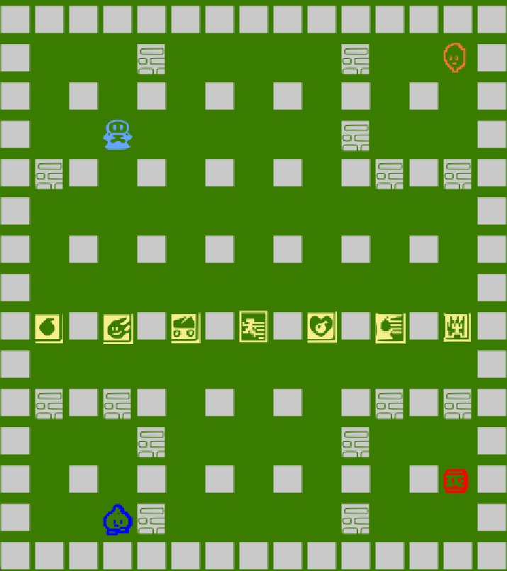

## LDTS_L08GR07 - BOMBERMAN

In this remake of the NES classic, Bomberman, you will be able to help again the robot Bomberman find his way through a maze, while avoiding enemies that try to stop you.
The maze is composed of several levels with variable difficulty that you can complete by successfully killing all enemies.

This project was developed by *Diogo Sarmento* (*up202109663*@fe.up.pt), *Manuel Neto* (*up202108744*@fe.up.pt) and *Tomás Vicente* (*up202108717*@fe.up.pt) for LDTS 2022⁄23.

## MENU

## BOMB

## FLAMES

## POWERUPS

## CHALLENGE

## GIF
